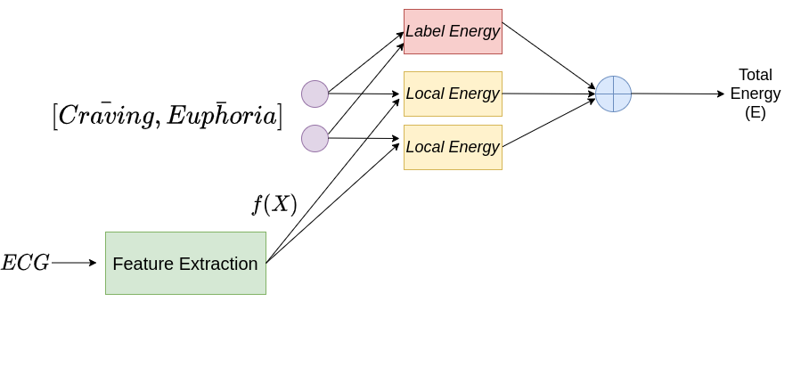

<!-- <b> OpiTrack: A Wearable-based Clinical Opioid Use Tracker with Temporal Convolutional Attention Networks</b>   <b>Bhanu Teja Gullapalli</b>, Stephanie Carreiro, Brittany P Chapman, Deepak Ganesan, Jan Sjoquist, Tauhidur Rahman. <i>Proceedings of the ACM on Interactive, Mobile, Wearable and Ubiquitous Technologies (IMWUT) (UbiComp '21).[[PDF]](https://bhanutejagullapalli.github.io/files/IMWUT_OpiTrack.pdf)</i> 

<b> Joint prediction of cocaine craving and euphoria using structured prediction energy networks</b>   <b>Bhanu Teja Gullapalli</b>, Gustavo A Angarita, Deepak Ganesan, Tauhidur Rahman. <i>Proceedings of the 2021 Workshop on Future of Digital Biomarkers. [[PDF]](https://bhanutejagullapalli.github.io/files/spen_craving_euphoria.pdf) </i>

<b>On-body Sensing of Cocaine Craving, Euphoria and Drug-Seeking Behavior using Cardiac and Respiratory Signals</b>   <b>Bhanu Teja Gullapalli</b>, Annamalai Natarajan, Gustavo A. Angarita, Robert T. Malison, Deepak Ganesan, Tauhidur Rahman. <i>Proceedings of the ACM on Interactive, Mobile, Wearable and Ubiquitous Technologies (IMWUT) (UbiComp '19).[[PDF]](https://bhanutejagullapalli.github.io/files/Ubicomp19-Craving.pdf)</i> 

<b>A New Hierarchical Clustering Algorithm to Identify Non-overlapping Like-minded Communities</b>  	Talasila Sai Deepak, Hindol Adhya, Shyamal Kejriwal,  <b>Bhanu Teja Gullapalli</b>, Saswata Shannigrahi. <i>Proceedings of the 27th ACM Conference on Hypertext and Social Media. ACM, 2016 [[PDF]](https://bhanutejagullapalli.github.io/files/cluster2016.pdf)</i> 
  -->

<table id="publications" width="2000" align="center" border="0" border-spacing="0" border-collapse="separate"
  cellspacing="0" cellpadding="100">
  <!-- <tr bgcolor="#ffffd0"> -->
  <tr>
    <td width="700" valign="top">
      
    </td>
    <td width="1400" valign="center">
      <a href="https://doi.org/10.1145/3478107">
        <papertitle>OpiTrack: A Wearable-based Clinical Opioid Use Tracker with Temporal Convolutional Attention Networks
        </papertitle>
      </a>
       
      <strong>Bhanu Teja Gullapalli</strong>,
      <a href="https://umasstox.com/about-us/faculty-fellows/stephanie-carreiro-md/"><author_names>Stephanie Carreiro</author_names></a>,
      Brittany P Chapman,
      <a href="https://people.cs.umass.edu/~dganesan/"><author_names>Deepak Ganesan</author_names></a>,
      <a href="https://www.linkedin.com/in/jansjoquist/"><author_names>Jan Sjoquist</author_names></a>,
      <a href="https://www.tauhidurrahman.com/"><author_names>Tauhidur Rahman</author_names></a>
       
      <em>Proceedings of the ACM on Interactive, Mobile, Wearable and Ubiquitous Technologies (IMWUT) </em>, (UbiComp ‘21) 
      [<a href="https://bhanutejagullapalli.github.io/files/IMWUT_OpiTrack.pdf">PDF</a>]
      [<a href="https://bhanutejagullapalli.github.io/files/slides/opitrack_slides.pptx">Slides</a>]
      [<a href="https://bhanutejagullapalli.github.io/files/IMWUT_OpiTrack.pdf">Video</a>]
       
      

        <abstract>
        Using the physiological signal data captured from the E4 wristwatch, we predict intravenous(IV) opioid administrations in a clinical setting. We built a channel-temporal attention TCN architecture (CTA-TCN), motivated by our observations and previous medical findings to detect administration in a time window. Along with the detection of administrations in a time window, we also predict the moment of administration with CTA-TCN. 
        </abstract>
      

    </td>
  </tr>

  <tr>
    <td width="700" valign="top">
      
    </td>
    <td width="1400" valign="center">
      <a href="https://dl.acm.org/doi/abs/10.1145/3469266.3469881">
        <papertitle>Joint prediction of cocaine craving and euphoria using structured prediction energy networks
        </papertitle>
      </a>
       
      <strong>Bhanu Teja Gullapalli</strong>,
      Gustavo A Angarita,
      <a href="https://people.cs.umass.edu/~dganesan/"><author_names>Deepak Ganesan</author_names></a>,
      <a href="https://www.tauhidurrahman.com/"><author_names>Tauhidur Rahman</author_names></a>
       
      <em>Proceedings of the 2021 Workshop on Future of Digital Biomarkers </em>, (DigiBiom '21) 
      [<a href="https://bhanutejagullapalli.github.io/files/spen_craving_euphoria.pdf">PDF</a>]
      [<a href="https://www.youtube.com/watch?v=GWDFOkj6gU0&ab_channel=ACMSIGMOBILEONLINE">Video</a>]
       
      

        <abstract>
        Addiction-related states craving and euphoria are interdependent and correlated. However, the state of the art digital biomarker technologies model these states independent of each other and thus fail to use the inherent relationship while making predictions. We use SPENs to jointly predict self-reported visual analog scale (VAS) ratings of cocaine craving and euphoria from cardiac signals captured from a wearable chest band
        </abstract>
      

    </td>
  </tr>
 </table>